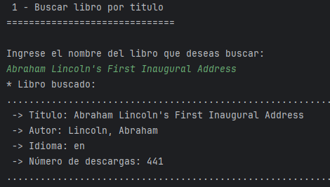
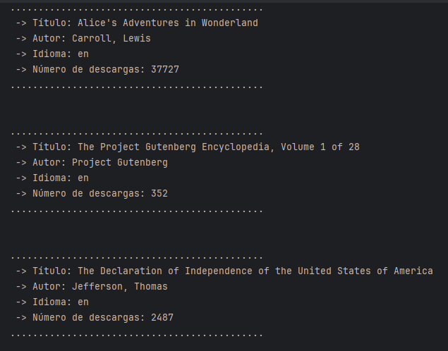
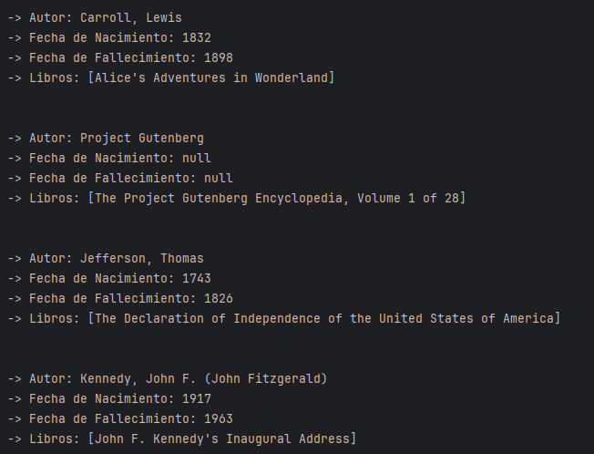
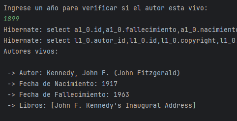
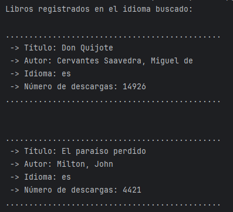
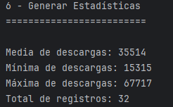
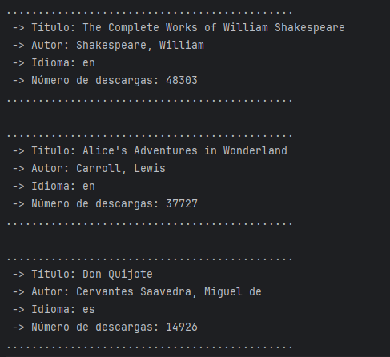
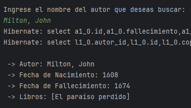

# Challenge - Literalura
## --------------------------------------------------------------------------------------------

    

## Funcionalidades
La biblioteca Literalura funciona utilizando una API, donde obtenemos informacion de todos los libros y autores. Literalura realiza las siguientes tareas:
1. **Buscar libro por título**: Esta funcion nos permite realizar una busqueda por el nombre del titulo del libro y nos inserta la información en la base de datos.
   

  

   
2. **Listar libros registrados**: Esta funcion nos permite ver todos los libros que han sido registrados en la base de datos.
   

  

  
3. **Listar autores registrados**: Esta funcion nos permite ver todos los autores que han sido registrados en la base de datos.
   

  

   
4. **Listar autores vivos en un determinado año**: Esta funcion nos permite listar los autores que estaban vivos en un determinado año.

  

   
5. **Listar libros por idioma**: Esta funcion nos permite ver libros por su idioma por ejemplo Español, Ingles, Frnances(podemos utilizar mas idiomas).

  

6. **Generar estadisticas**: Nos permite ver las descargas de los libros.

  

7. **Top 10 libros más descargados**: Esta funcion nos permite ver los 10 libros más descargados de la biblioteca.

  

8. **Buscar autor por nombre**: Raliza una busqueda por nombre del autor en la base de datos.

  

------

## GUTENDEX API
Es un formato de respuesta API: Para utilizar esta API tenemos que ingresar a su pagina [Gutendex-API](https://gutendex.com) para obtener toda la informacion sobre los libros y autores que nos proporciona una variedad de libros en linea.

------

## Tecnologias utilizadas
* Intellij IDEA Community Edition
* JDK 21
* Java 21
* PostgreSQL 16
* Maven
* Spring Boot 3.3.0

------
